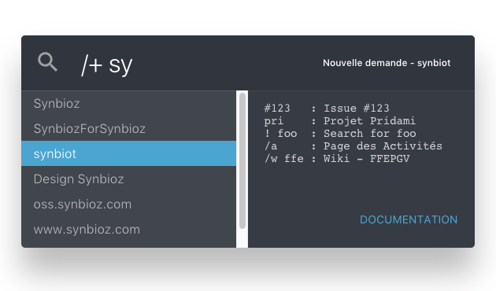

# Redspot

Current version : `1.0.0`

Redspot is a _keyboard-only_ **Redmine Plugin** that help users to navigate
efficiently and rapidly in redmine features and pages. Inspired by Spotlight.

**Installation**, **Contribution** or **Theming** stuff are explained in the [Developer Guide](developer.md)

---

1. To launch Redspot type **ESC** (escape) anywhere in Redmine.
1. When you type something, the tooltip on the right show you the current action.
1. Run the action with **ENTER**

That's all folks !

# Features

## Go to an Issue

To access issue #12345, just type `#12345` in Redspot.


## Change project and/or page

You can go to a given page of any project by typing:
```
/command [projet]
```
If the first selected result in the list is not the one you want, move in the list with **Up** or **Down** arrow keys.
Commands can omit the project name if the targeted project is the current one.

### Go to Synbioz wiki


### Create new issue in Synbiot project



## Search anything

You can use the search engine of Redmine directly in Redspot.
Start with a bang `!` and type the wanted words.


Add spaces between composed names.

## Create a new project

If you didn't type any command and no project is found, Redspot allow you to create a new project.


---

## Available commands

| Name (FR) | /command  | Destination |
|:---|:---|:---|
| Activity |  **`/a`**, `/activity` | `/activity` |
| Roadmap |  **`/r`**, `/roadmap` | `/roadmap` |
| Issues |  **`/#`**, `/i`, `/issues` | `/issues` |
| New Issue |  **`/+`**, `/new` | `/issues/new` |
| Gantt |  **`/g`**, `/gantt` | `/issues/gantt` |
| Calendar |  **`/c`**, `/calendar` | `/issues/calendar` |
| News |  **`/n`**, `/news` | `/news` |
| Documents |  **`/d`**, `/documents` | `/documents` |
| Wiki |  **`/w`**, `/wiki` | `/wiki` |
| Wiki by date |  **`/wd`** | `/wiki/date_index` |
| Wiki by title |  **`/wt`** | `/wiki/index` |
| Files |  **`/f`**, `/files` | `/files` |
| Settings |  **`/s`**, `/settings` | `/settings` |

---
