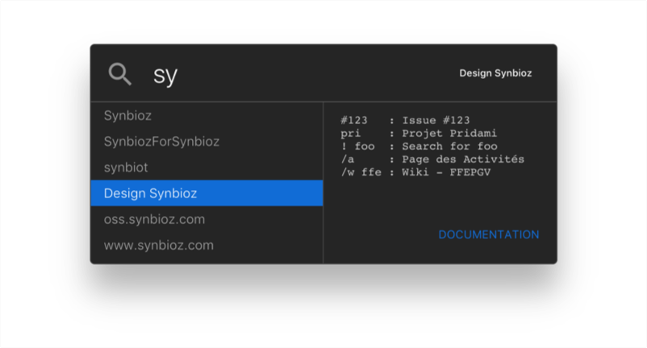
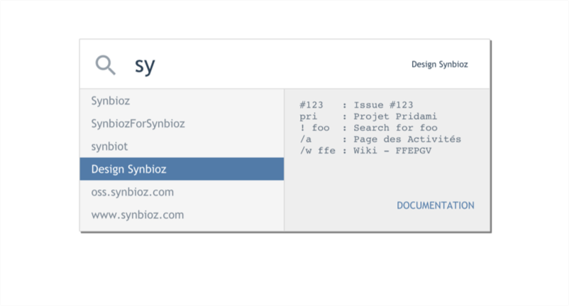
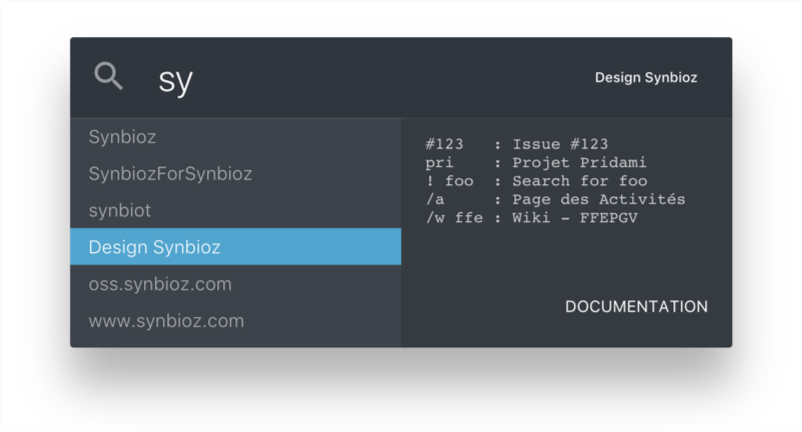
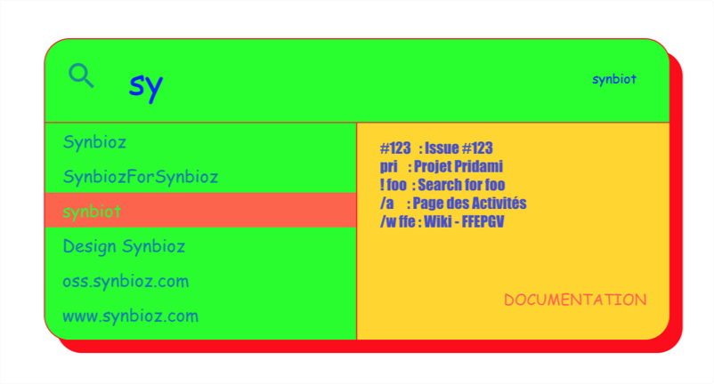

# Redmine Plugin Installation

To install the Redspot plugin on your Redmine instance, 3 easy steps :

1. Go to the `plugins/` Redmine directory,
1. Clone this repository,
1. Restart the Redmine rails server & enjoy.

# Development

To watch and build the plugin on change, run :
```
rake dev
```
It will open your browser on [http://localhost:8080/](http://localhost:8080/)
with a default projet selector to initialize Redspot.

## Update

When you update the VueJS App, change the plugin version in VERSION.

Then :
```
rake build
```
Generated webpack files will be copied in their Redmine plugin directories.

For specific actions on the VueJS App, please look at
[redspot_vuejs/README.md](redspot_vuejs/README.md)

## Theming

### Custom

You can override many variables to customize you Redspot.

Override line 1 in `style.sass` with the theme you wanna use and take inspiration from other themes.

You can also choose an existing theme from the followings :

### theme-defaut.sass

> Close to the Spotlight look'n'feel, simple and dark with a subtle touch of deep blue.

### theme-redmine.sass

> From the oldschool Redmine theme, shade of grey and big borders.

### theme-synbioz.sass

> Personnalized theme for the internal Synbioz's redmine instance.

### theme-wow.sass

> Wow, so much colors, just to show that you can make your dream comes true.